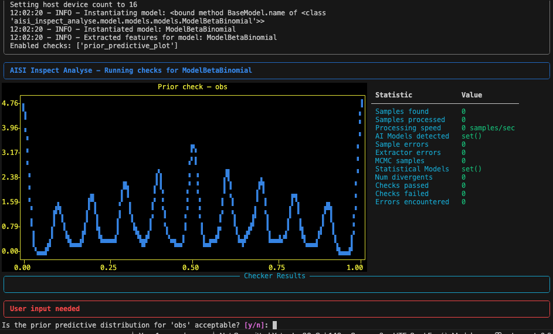

# HiBayES

A Python package for analysing data from [Inspect](https://github.com/UKGovernmentBEIS/inspect_ai) logs using statistical modeling techniques.

## 🚧 Work In Progress 🚧

This package is currently in development. Functionality will change and bugs are expected. **We very much value your feedback and contributions**. Please open an issue or pull request if you have any suggestions or find any bugs.

There are a list of known issues and TODOs at the end of this document.

## Table of Contents
- [HiBayES](#hibayes)
  - [🚧 Work In Progress 🚧](#-work-in-progress-)
  - [Table of Contents](#table-of-contents)
  - [Installation](#installation)
  - [DVC](#dvc)
  - [quick start examples](#quick-start-examples)
  - [Features](#features)
  - [Example command line usage](#example-command-line-usage)
    - [loading](#loading)
    - [modelling](#modelling)
    - [communicating](#communicating)
    - [Full pipeline](#full-pipeline)
  - [Configuration](#configuration)
  - [TODOs](#todos)

## Installation

```bash
git clone git@github.com:UKGovernmentBEIS/hibayes.git
cd hibayes
pip install -e .
```

or with uv

```bash
git clone git@github.com:UKGovernmentBEIS/hibayes.git
cd hibayes
uv venv .venv
uv sync # if you want to exactly match dependencies
uv pip install -e .
```

if you would like to contribute please install the dev dependencies:

```bash
uv pip install -e .[dev]
```


## DVC
This package uses [DVC](https://dvc.org/) for data version control. This ensures that all analysis is reproducible/auditable.

To reproduce analysis cd to an examples directory and run `dvc repro`.

```bash
cd examples/cybench/
uv run dvc repro
```
This will run the pipeline defined in the `dvc.yaml` file. This will run the full analysis pipeline. If you run it again, only the stages that have changed will run. Check the `dvc.yaml` file for details on which commands are run and what inputs they depend on/track.

To set up your own experiment and have DVC track it:

```bash
mkdir .experiments/name_of_experiment
cd .experiments/
git init # need git to track the dvc files
cd name_of_experiment
uv run dvc init --subdir # you can have multiple experiments in .experiments
```

OR if you want to contribute your experiment to the main repo as an example:

```bash
mkdir examples/name_of_experiment
cd examples/name_of_experiment
uv run dvc init --subdir
```


This will create a `.dvc` directory and a `.dvcignore` file. You can then create your DC pipeline by adding stages to the `dvc.yaml` file. See [example dvc.yaml](exmples/cybench/dvc.yaml) for a sample pipeline.

Then you can run the pipeline with:

```bash
dvc repro
```


## quick start examples.

```bash
cd examples/cybench/
uv run dvc repro
```
or without dvc
```bash
cd examples/cybench/
uv run python main.py \
    --config files/config.yaml --data files/data.csv \
    --out .output/
```

Fitting a statistical model to to data is never plug and play and therefore there are a number of checks that are run to ensure the approriateness of your model. Some require user approval e.g. prior predictive checks:




Checkout the output directory for the saved [analysis_state](src/hibayes/analysis_state.py) containing all the results of the analysis.

## Features

HiBayES consists of the following components which can be chained together to form a complete analysis pipeline:

1. **Loading** data from multiple Inspect AI logs with customisable extractors
2. **Modeling** data using statistical models
3. **Communicating** results with detailed diagnostics and visualisations

hibayes is designed so that any component can be run in isolation, allowing for flexiblity and the possibility for data/model exploration.

## Example command line usage

### loading
```bash
uv run hibayes-load --config <path-to-config.yaml> \
    --out <path-to-store-processed-data>
```
### modelling
```bash
uv run hibayes-model --config <path-to-config.yaml> \
    --data .output/load/data.parquet \
    --out <path-to-model-fit-results>
```
### communicating
```bash
uv run hibayes-comm --config <path-to-config.yaml> \
      --analysis_state <path-to-model-fit-results> \
      --out <path-to-communicate-results>
```
### Full pipeline
```bash
uv run hibayes-full --config <path-to-config.yaml> \
    --out <path-to-model-fit-results>
```

## Configuration

The package uses YAML configuration files to define the analysis pipeline. Here we detail some of the features you can use in th configuration file.

```yaml
data_loader:
  paths:
    files_to_process: # provide a list of files to process, these can be .json or .eval files
      - path/to/a/log.eval
      - path/to/logs/ # or a dir of logs
      - path/to/file/which/list/logs.txt or a txt file with a list of dirs/logs.
  extractors:
    enabled:
      - base # select from a set of extractors which specify what you would like extracted from the eval logs.
      - tokens
      - tools
    custom: # optional: add your own custom extractors
      path: path/to/custom_extractors.py
      classes:
        - CustomMetadataExtractor # list of custom extractors you would like you use see examples/gaia/files/extractors.py as an example.

model:
  models: # list of default models to run. See src/hibayes/model/model.py for available models.
    ModelOneName:
      mapping_name:
        score: success # optional mapping from data names to model feature names
    ModelTwoName:
      parameters:
      configurable_parameters: # optional: update model parameters with custom distributions and hyperparameters
        name: overall_mean # name of parameter - note: it must be listed as a 'configurable_parameter' in the model
        prior:
          distribution: normal
          distribution_args:
            loc: 0
            scale: 100 # here we increase the std of the normal prior distribution to 100 :O

checkers: # list of methods to check the model fit.
  checks: # these are all available checks
      - prior_predictive_plot
      - r_hat
      - divergences
      - ess_bulk
      - ess_tail
      - loo
      - bfmi
      - posterior_predictive_plot
      - waic
  custom_checks: # see examples/gaia/files/custom_checker.py for a mock example
    path: path/to/custom_checks.py
    checks:
      - posterior_mean_positive: {param: mu_overall, threshold: 0} # name of the checker with optional parameters

# similar customisation can be used for the platform config and the communication config.
```


## TODOs

- move these to issues
- Add data loader which checks if .json or .eval is passed
- Add check that extractors will extract required variables before data is loaded
- Add functionality to allow for non-parallel processing
- Break up the load.py file into modular components
- Add more informative extractor failure messages
- Allow for configuration initialization
- Add modular function to upload processed files to S3
- clean way to check for cached logs automatically given arg.
- Implement tagging for loaded logs
- Add pytest approach for model checks (pass/fail with diagnostic information)
- Move to functional approach with registry rather than class-based approach
- ^ This is a big one, still need to port extractors and models to this approach.
- Flesh out default configs for models
- Add links to tutorials on interpreting model fit failures
- Add posterior predictive checks
- Add more diagnostic functionality.
- Add model comparisin.
- Do we need to be more strit on the desgin of functions which act on analysis state?
- Add a "data story" attribute describing the model purpose
- prettier plots for prior predictive checks
- add gpu tpu support
- statistics table needs updating for model display
- factor in failed samples into the analysis
- we dont really need to do display.logger.blah blah. The display manages the logger handling. Remove for simplicity.
- todo add prior plots for histogram prior
- add some public inspect logs for examples and testing.
- update plots to follow https://python.arviz.org/en/stable/ styling
- better error logging for easy debugging
- add an acknowledgement section to the readme - numpyro, arviz
- debug why bfmi failing
- in loading separate the IO bound from the CPU bound. async IO to get queue of files to process which are then processed in parallel - this is currently diprioritised as others are working on an Inspect database.
- support to run a model type multiple times in the same config with different parameters.
- update checker dir from analyse to check
- data filtration step....
- Jupyter notebook support.
- move from rich to textualise display to allow mouse interaction (click approval)
- add display method to update stats from analysis state (now that we have broken up the pipeline)
